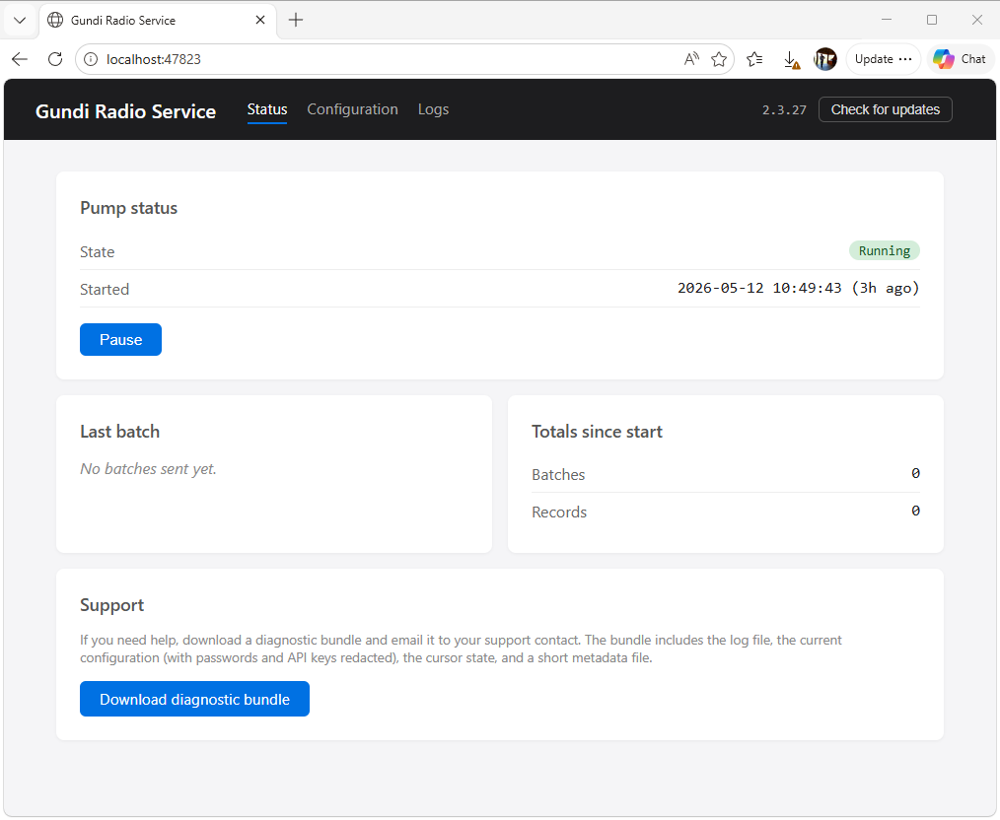

# Gundi Radio Service

A small Windows Service that forwards radio location data from a
local dispatch console to **Gundi** / **EarthRanger** so wildlife
rangers see vehicle and personnel positions in real time.

It installs once on the dispatcher's box, runs in the background,
and stays out of the way. A built-in web UI handles configuration,
monitoring, and self-updates.

<!-- Replace with a screenshot of the Status page (Pump status card +
     header version). Suggested file: images/status-page.png.
     Recommended capture: Edge or Chrome at ~1200x800, the service
     in the Running state with at least one batch under its belt. -->
{ width="800" }

## What it does

- **Reads** location records from one of four supported radio
  dispatch databases (Smart Dispatch Plus, Smart One Dispatch,
  Kenwood KAS20, TRBOnet).
- **Forwards** them in batches to one or more Gundi / EarthRanger
  destinations, filtered by radio group if you want.
- **Keeps going** across reboots, network blips, and service
  restarts — backed by a cursor file so no records get re-sent and
  none get skipped.

## Three things that make it easy to live with

**Set it up once, in a browser.** A first-run wizard walks an
operator through the database connection and the Gundi
destinations. No config files to edit, no command line. The same
UI is available from the desktop shortcut any time you want to
check on it.

**Updates apply themselves.** When a new version is published, the
Status page surfaces an "Update to X.Y.Z" button. Click it once —
the service swaps itself in place, restarts, and you're done.

**Honest about its state.** The Status page shows whether the
pump is running, when the last batch went out, what the cursor
is currently at, and the last error if there was one. If
something's wrong, the operator (or a support tech) can see what
without grepping log files.

## What it doesn't try to do

- **Run as a cloud service.** Everything runs on the customer's
  Windows box. No data leaves the box except the outbound HTTPS
  call to Gundi.
- **Replace the dispatch console.** It reads the same database
  the dispatch software writes; it doesn't talk to radios
  directly.
- **Authenticate the local UI.** The UI is bound to localhost
  only, so it's only reachable from the box itself. The model
  assumes the operator using the UI is the same person who
  installed the service.

---

Ready to install? Head to **[Get started](getting-started.md)**.
