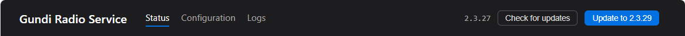

# Updating

The service updates itself. You click a button; it does the
rest. No re-download, no re-install, no settings to re-enter.

## How it works in the UI

The header on every page shows the current version on the right.
When you (or anyone with the page open) clicks **Check for
updates**, the button briefly says "Checking…" then resolves to
one of three states:

- **✓ Up to date** — you're on the latest version. Nothing to do.
- **Update to X.Y.Z** — a newer version is available. A blue
  button appears next to "Check for updates." Click it when
  you're ready.
- **✗ Could not check…** — the service couldn't reach the update
  feed. The error text shows inline; usually a transient network
  issue. Try again in a minute.

<!-- Replace with a header-area screenshot showing the
     "Update to X.Y.Z" button next to the version. Suggested file:
     images/header-update-available.png. -->
{ width="800" }

## What happens when you click "Update to X.Y.Z"

About a minute end-to-end. In order:

1. The service downloads the new version into a staging area.
2. An "Update downloaded" success message appears.
3. The service shuts itself down so the file swap can complete.
4. Your browser tab loses its connection — a **Connection
   lost** modal appears with a **Refresh page** button.
5. Behind the scenes, the new version's files replace the old
   ones, and SCM starts the service on the new build.
6. When you click **Refresh page**, the button polls the local
   port until the new service is answering, then reloads. You
   land on the Status page running the new version.

<!-- Replace with a screen recording of the full flow:
     click Update → success message → connection lost modal →
     click Refresh → page reloads on new version.
     Suggested file: videos/update-flow.mp4 (about 60 seconds).
     MP4 needs an HTML <video> block, not image syntax (Markdown
     image syntax only renders to , so an .mp4 there would
     just be a broken-image icon). Uncomment the block below when
     the recording is in place. -->
<!--
<video controls width="800">
  <source src="videos/update-flow.mp4" type="video/mp4">
</video>
-->

## What survives the update

- **Configuration.** Database settings, destinations, API keys
  — all preserved in `C:\ProgramData\GundiRadioService\appsettings.json`,
  which is outside the install directory.
- **Pump cursor.** No batches re-sent, no batches skipped.
  The cursor lives in `C:\ProgramData\GundiRadioService\state.json`,
  same protection.
- **Desktop shortcut.** Auto-refreshed during the update so the
  URL stays current even if a future release changes the bind
  port.

## What gets replaced

- **The service binaries**, swapped in place via Velopack.
- **The Windows Service registration** stays — SCM continues to
  manage the service the same way; only the binary at the
  registered path is now newer.

## If the connection-lost modal doesn't appear

You may have clicked Refresh before the page noticed it was
disconnected, or your browser's reconnection threshold may have
fired first. Either way, manually pressing **Refresh** on the
browser does the same thing — it'll either land on the running
new version or hit a connection-refused error briefly while the
service is mid-restart, in which case wait 10 seconds and refresh
again.

If after a couple of minutes the page still won't load, head to
**[Troubleshooting](troubleshooting.md)** — there's a checklist
for an update that didn't complete cleanly.

## What if I want the old version back?

Out of scope today — there's no in-UI downgrade button.
Velopack keeps the previous version's package in
`C:\Program Files (x86)\GundiRadioService\packages\` for a
short while, so support can roll back manually if needed. Email
the diagnostic bundle (Status page → Support card → Download
diagnostic bundle) and include "please roll back" in the
message.
