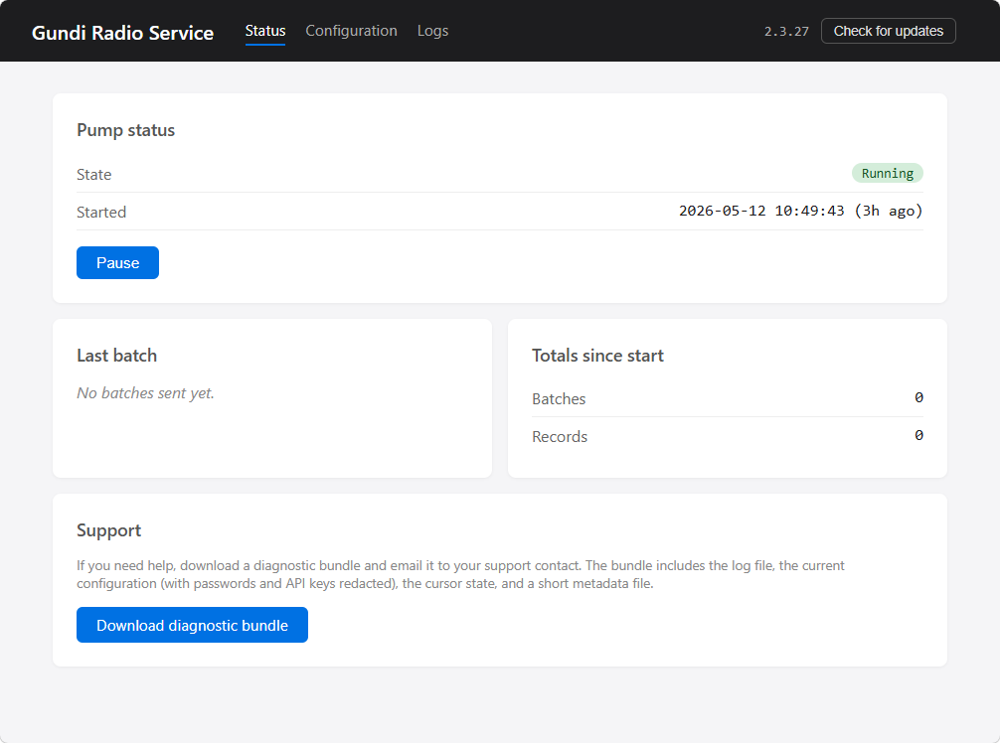

# Using the service

The service is meant to be quiet — once it's set up, you mostly
forget about it. The web UI is for the times you need to look in.

Open it from the **Gundi Radio Service** desktop shortcut, or
type `http://localhost:47823` into a browser on the same box.

## Status page

<!-- Replace with a Status-page screenshot taken on a healthy
     install with a few thousand batches under its belt.
     Suggested file: images/status-page-healthy.png. -->
{ width="800" }

Four cards on the Status page, in this order:

**Pump status.** Whether the pump is currently Running, Paused,
or Stopped. The Started timestamp tells you when the service last
came up. If something has gone wrong, a yellow "Last error" box
appears beneath the state — dismissible with the × on the right.

**Last batch.** When the most recent batch was forwarded, how
many records it contained, and the cursor at the time. The "X
seconds ago" text under the timestamp ticks up live so you can
glance at the page and see whether the pump is moving.

**Totals since start.** Cumulative batches and records since the
service last started. Reset on every restart (intentional — these
are "is it healthy" gauges, not historical metrics).

**Support.** A single button: **Download diagnostic bundle**.
Builds a zip containing the log file, archived logs, the current
configuration (with passwords and API keys redacted), the cursor
state, and a metadata summary. Email it to support if you ever
need a hand.

## Header controls

The dark bar at the top of every page shows:

- The app name (left).
- The nav links: **Status**, **Configuration**, **Logs** (centre).
- The current version + **Check for updates** button (right).

When an update is found, the right side gains an **Update to
X.Y.Z** button. See **[Updating](updating.md)** for what happens
when you click it.

## Pausing the pump

The **Pause** / **Resume** button is on the Pump status card.
Pausing stops the pump from posting new batches without
unregistering the service or restarting anything. Useful when:

- You want to do maintenance on Gundi and don't want failed-post
  warnings in the log.
- You're testing changes to the source database and don't want
  half-written rows forwarded.

Paused state survives across service restarts. Don't forget to
resume.

## Editing configuration

The Configuration page (header → **Configuration**) is the same
form the wizard showed, broken into two cards:

- **Database connection.** Reader type, host, database name,
  username, password, schema, batch tuning. **Test connection**
  works the same as in the wizard.
- **Gundi destinations.** Add, edit, or remove destinations.
  Group-alias picker too.

Click **Save** at the bottom. The pump reloads with the new
settings — no service restart needed. Existing in-flight batches
finish under the old settings, then the next batch picks up the
new ones.

!!! tip "Passwords and API keys"
    Empty fields are interpreted as "keep the existing value."
    Both the password and API-key inputs show a placeholder
    "(unchanged)" when there's already one saved. Type a new
    value only when you want to replace it; leave blank to
    preserve.

## Reading the log

Header → **Logs** opens the log viewer. It tails the same file
NLog writes to disk
(`C:\Program Files (x86)\GundiRadioService\current\radioservice.log`),
plus any archived rolls under `logs/`.

A few common log lines to recognise:

- `Posting batch of N observations` — normal pump activity, fires
  on every batch.
- `Heartbeat: idle for N minutes; cursor at …` — once per
  heartbeat interval when the pump has nothing to do. The
  default interval is 60 minutes; tunable via
  `Heartbeat:IntervalMinutes` in
  `C:\ProgramData\GundiRadioService\appsettings.json`.
- `Update applied; signalling host to stop so the swap can
  complete.` — an auto-update is in progress; see
  **[Updating](updating.md)**.
- `Database error (attempt N/5)` — pump hit a transient error
  and is retrying. After 5 attempts the pump idles and waits for
  the next interval rather than crash-looping.

## Where things live on disk

| What | Where |
|---|---|
| Service exe + binaries | `C:\Program Files (x86)\GundiRadioService\current\` |
| Log file (current) | `C:\Program Files (x86)\GundiRadioService\current\radioservice.log` |
| Archived log rolls | `C:\Program Files (x86)\GundiRadioService\current\logs\` |
| Operator config | `C:\ProgramData\GundiRadioService\appsettings.json` |
| Pump cursor | `C:\ProgramData\GundiRadioService\state.json` |
| Desktop shortcut | `C:\Users\Public\Desktop\Gundi Radio Service.url` |

The two files in `C:\ProgramData\GundiRadioService\` are
deliberately outside the install directory so they survive
auto-updates intact.
