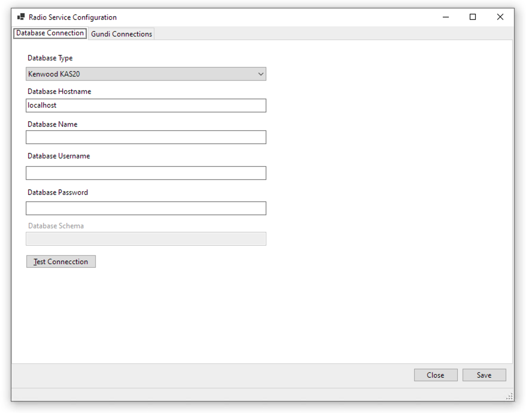
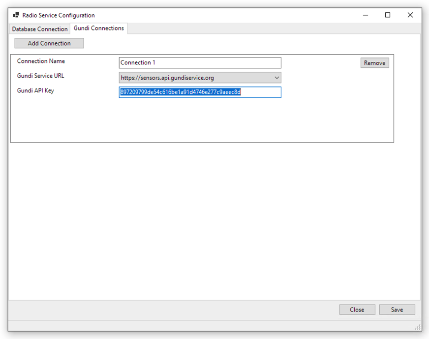

# Gundi Radio Service (rc.2)

The Gundi Radio Service is a Windows application that's designed to monitor a database used by a radio system. Currently this application can read data from:

Hytera Smart Dispatch Plus

Hytera Smart One Dispatch

Kenwood KAS20s

TRBOnet Plus

## Using the Service

The Gundi Radio Service is packaged as a zip file that you can get from the Gundi team.

### Prerequisites

In order to install the Gundi Radio Service, you'll need to meet these prerequisites.

* Installed version of one of:
  * Kenwood KAS-20
  * Hytera Smart Dispatch Plus
  * Hytera Smart One Dispatch
  * TRBOnet Plus (distributed by Motorola)
  
* Credentials for the database used by the radio dispatch software.
  * For KAS-20 and TRBOnet Plus, this is a SQL Server database
  * For Smart Dispatch Plus this is a PostgreSQL database
* A Gundi API Key (get this from the Gundi team)
* Administrator privileges on your Windows PC

### Installation

Place the files.

1. Save the GundiRadioService.zip file to your Windows PC filesystem.
2. Unzip the files to a folder (ex. C:\EarthRanger\GundiRadioService\)
3. **As an Administrator**, open a Command Prompt and change directory to where you unzipped the files in step 1.

Configure the Service.

1. Run this command and enter data as prompted:
   *Find descriptions about the configuration settings at the end of this section.*
   ```shell
   RadioService.exe /configure
   ```
   This will open a window for configuring the connection to a database and to one or more Gundi connections. It will look something like what's shown below.
   

2. After entering the database connection details, click "Test Connection" to validate the configuration.

3. Use the "Gundi Connections" tab to enter one or more places to send the GPS data. Click the "Add Connection" button and fill in the details for a Gundi Connection (these are found at https://gundiservice.org).


4. Click **Save** to write the configuration updates to the RadioService settings file.

5. [Optional] Test the configuration by running the application directly.

   ```shell
   RadioService.exe
   ```

   You'll see some output that will indicate whether things are operating correctly. If you see errors, you might need to re-do the configuration step above.

   Press **Ctrl-C** to stop the application.

6. Once you're satisfied with the configuration, you're ready to install it as a Windows Service.

   Run this command to install the application as a Windows Service:

   ```shell
   RadioService.exe /install
   ```

   This will create a Windows Service named "Gundi Radio Service". It will run automatically, monitoring your radio system's database and forwarding new GPS data to Gundi.

| Configuration Item | Example                              | Description                                                  |
| :----------------- | :----------------------------------- | -----------------------------------------------------------: |
| Destination      | Https://sensors.api.gundiservice.org | This is already set and should only be changed if directed by the Gundi engineering team. |
| Gundi API Key    | `4b8241268712c896e8fbcc857b2343`     | This is a secret key for accessing Gundi's APIs. You'll get this value from https://gundiservice.org or from a Gundi team memeber. |
| Database Type | Choose from: <br />* Kenwood KAS20<br />* Smart One Dispatch<br />* Smart Dispatch Plus<br />* TRBOnet Plus | This application supports two types of radio systems. |
| Database Server | `localhost` | This is the server where the database is installed. Typically you can leave this as `localhost`. |
| Database Name | `rds`or `KAS20` or `puc`or `TRBOnet1` | This is a the name of the database where your radio system records data. |
| Database Schema | `dbo` | This is a the name of the schema within the database. |
| Database User | `postgres` or `KAS20Admin` | Database username |
| Database Password | `some-secret` | The password used to connect to the datbase. |

